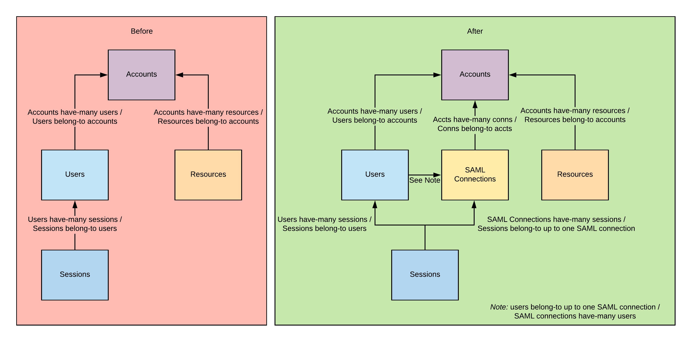
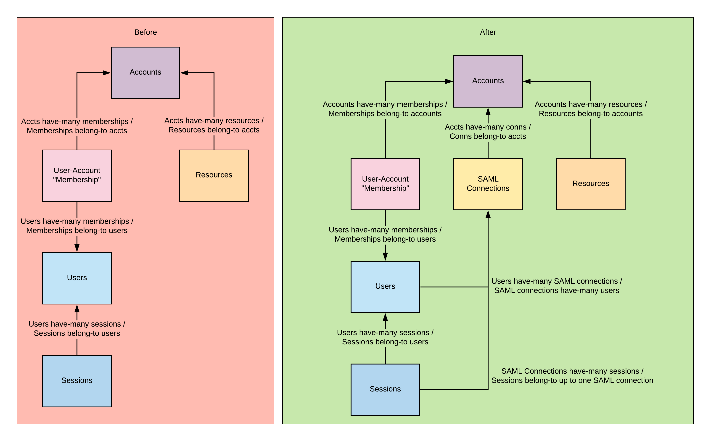

# saml

[](https://pkg.go.dev/mod/github.com/ucarion/saml?tab=overview)
[](https://github.com/ucarion/saml/actions)

This package is a Golang implementation of [Secure Assertion Markup Language
v2.0][oasis], commonly known as "SAML". This package features:

1. **An extremely simple interface that's easy to integrate with.** Many Golang
   implementations give you tons of functions and types you can use, and it's
   not clear what you're meant to do. This package only gives you two functions:
   one for accepting SAML logins, and another for parsing Identity Provider
   metadata into useful information.

1. **No presumption of how your application works.** SAML is a legacy, but
   important, protocol. You do not want to put SAML everywhere in your
   application; instead, you should evaluate how to wedge support for SAML into
   your existing authentication as unintrusively as possible.

   To that end, this package does not attempt to intercept with HTTP handlers or
   presume whether you're making a single-tenant or multi-tenant system.
   Instead, this package gives you useful, secure building blocks that you can
   fit into your systems.

1. **An emphasis on security.** There are a lot of ways to introduce security
   vulnerabilities in SAML implementations, and most existing Golang packages
   make it too easy to make common mistakes.

   This package only gives you secure ways to handle SAML logins. You cannot
   skip security checks. In particular, this package will always verify that
   SAML responses are authentic, not expired, issued by the identity provider
   you expected, and intended to be consumed by you.

## Installation

You can install this package by running:

```bash
go get github.com/ucarion/saml
```

## Usage

> For working, self-contained demos of how you can use this package, check out
> the [`examples`](./examples) directory.

### Handling SAML Logins

To accept a SAML login, you would usually write something like:

```go
http.HandleFunc("/acs", func(w http.ResponseWriter, r *http.Request) {
  samlResponse, err := saml.Verify(
    r.FormValue(saml.ParamSAMLResponse),
    "https://customer-idp.example.com",
    customerCertificate,
    "https://your-service.example.com",
    time.Now(),
  )

  if err != nil {
    // Give back a 400 response or something, up to you ...
  }

  // See "Integrating with SAML" section below for suggested approaches to
  // handling a valid SAML login.
  //
  // ...
}
```

### Initiating a SAML Login

Kicking off a SAML login is so easy this package doesn't even give you a method
for it. Just do:

```go
http.HandleFunc("/initiate", func(w http.ResponseWriter, r *http.Request) {
  http.Redirect(w, r, "https://customer-idp.example.com/init", http.StatusFound)
}
```

### Getting Identity Provider Configuration

In the examples above, you need three pieces of information from your customer:

1. The customer's Identity Provider "ID". That was
   "https://customer-idp.example.com" in the example above.
2. The customer's Identity Provider certificate. That was `customerCertificate`
   above.
3. The customer's Identity Provider redirect URL. That was
   "https://customer-idp.example.com/init" above.

You can have your customers input those into your application on their own, but
a more streamlined process is for them to upload their Identity Provider
"metadata" to your application. This package gives you a way to parse and
extract information from Identity Provider metadata. Just do:

```go
http.HandleFunc("/setup", func(w http.ResponseWriter, r *http.Request) {
  var metadata saml.EntityDescriptor
  if err := xml.NewDecoder(r.Body).Decode(&metadata); err != nil {
    // Give back a 400 response or something, up to you ...
  }

  idpID, customerCertificate, redirectURL, err := metadata.GetEntityIDCertificateAndRedirectURL()
  if err != nil {
    // Give back a 400 response or something, up to you ...
  }

  // Now you can store the Identity Provider ID, certificate, and redirect
  // URL someplace where you can retreive it later.
  //
  // ...
}
```

## Integrating with SAML

> This section gives guidance on how you should consider integrating SAML logins
> into your existing application. It assumes you are building something like a
> B2B SaaS product, and want to add Single Sign-On functionality using SAML.
>
> If you want to see a working example application built on top of this package,
> check out [`examples/saml-todo-app`](./examples/saml-todo-app). Its design
> follows the recommendations in this section.

### Typical Customer Expectations

To have success with SAML, you must first understand what it gives you: **a SAML
connection is essentially a customer-controlled factory of users**. Customers
want SAML because they want to control what employees can access your app, and
they want to be able to grant or revoke that access at will. Your integration
with SAML should be designed with that in mind.

Companies love Single Sign-On (and thus SAML) because it moves the problem of
"can Jane get access to FooApp?" into a single place: their corporate identity
provider (aka their "IdP", e.g. Okta, OneLogin, etc.). They want:

* IT to be able to let Jane log into your app just by giving her access to the
  relevant SAML connection in their IdP.
* Jane to be able to use your app by just clicking on your app's logo in her IdP
  account.
* If Jane ever leaves the company, the IT team can just delete Jane's account in
  the identity provider, and she can't log into anything anymore.
* If Jane changes roles, IT can remove the SAML connection from her account, and
  they know she can't log into your app anymore.

In particular, what this means for you is:

1. **You should support having users that can log in with SAML but not
   username/password.** The nice thing about Single Sign-On is that it means
   employees only need to remember one password: their corporate identity
   provider password.

   If you force your customer's employees to have a password in your
   application, then you've lost a lot of the value of Single Sign-On. You'll
   end up with your customers' IT team asking you for the ability to
   programmatically delete users from your app, because they're worried about
   Jane's weak password being leaked, and then someone logging in as Jane and
   stealing company data.

1. **You should support "just-in-time" provisioning of accounts.** If someone
   logs in with SAML and you don't have a user for them already created, you
   should auto-create one for them on the spot.

   Single Sign-On is about automating provisioning. If you make your users
   create an account *outside* of SAML first, and only then support logging in
   via SAML, then not only are you ignoring the first suggestion (supporting
   passwordless users), but you're also adding extra steps that SAML is supposed
   to automate for customers.

1. **You should support disabling password-based logins.** Some smaller
   companies still transitioning to the centrally-managed approach of coroporate
   identity providers might want to support having both SAML-based and
   password-based logins into the same app. But the big companies want to be
   able to guarantee that there are no password-based logins into your app.

   No passwords means no password leaks, and no circumventing the
   centrally-managed rules in their IdP. That's a big security win for your
   customers.

You should also be aware of this important bit of security context:

* **An Identity Provider can put *anything* they like in a SAML assertion.**
  There is no guarantee that Identity Providers won't try to send you nefarious
  SAML assertions. For example, an IdP is allowed to claim they have a user with
  the email steve.jobs@apple.com, no verification required. There is no global
  SAML police.

  If you don't keep this in mind, you might accidentally introduce
  vulnerabilities in your SAML implementation. For instance, don't solely rely
  on an `email` attribute in SAML logins to decide what user to log someone in
  as. Otherwise an attacker could log in as anyone they like just by adding a
  phony user to their IdP with the right email, and then sending you a SAML
  login with that email.

  What this means for you is: trust a SAML login *only* within the context of
  the account that has established a trust relationship with the associated IdP.
  What Company A's Identity Provider says should not have *any* bearing on what
  they can do with Company B's resources in your product.

### A Playbook for Introducing SAML

With all of that context, here is a playbook can follow to figure out how you
should introduce SAML into your product. As you follow along, the most important
fork in the road is whether your users exclusively belong to an "account" (or
whatever your "root-level resource" is), or whether users can be in multiple
accounts.

If your users exclusively belong to your root-level resource, then your
transition to supporting SAML will look something like this:

> 
>
> A SAML transition plan for products that work roughly like AWS, where users
> belong to accounts.

If your users can be in multiple instances of your root-level resource, then
your transition to supporting SAML will look something like this:

> 
>
> A SAML transition plan for products that work roughly like GitHub, where users
> can be in multiple accounts, and don't really "belong to" any particular
> account.

Don't worry if not everything in these pictures make sense yet. As you go
through this playbook, consider jumping back up to this diagram to help make
things clearer.

1. **Identify your root-level resource.** The root-level resource is the thing
   that's the "parent" of most other resources in your system -- most other
   things belong-to it. Usually, billing information is associated with this
   root-level resource. Oftentimes, customers will only have one (or very few,
   maybe one per business unit or environment) instances of the root-level
   resource. To customers, accounts might be an "invisible" resource, because a
   session can never see accounts outside of the one they're issued for.

   For example, in AWS, an AWS account is the root-level resource. In GitHub,
   users and organizations are the root-level resources, but for the purposes of
   a business-tier account it's the organization resource that matters most. In
   Stripe, a Stripe account is the root-level resource, and is a
   mostly-invisible resource when you're using their API.

1. **Determine the relation between users and your root-level resource.**
   Broadly speaking, there are two typical relations users and root-level
   resources can have in most SaaS products:

    * In a *belongs-to* relationship, users exist in exactly one root-level
      resource, and belong to the root-level resource they're in. If you delete
      the root-level resource, you also delete the user.

      AWS and Stripe are examples of this. All AWS IAM users belong to an AWS
      account. All Stripe users / tokens belong to a Stripe account.

      Broadly speaking, most B2B SaaS companies work like this. You're doing
      business with a company, and everything in your system should be
      attributable to a billable corporate customer.

    * In a *has-and-belongs-to-many* relationship, users can exist in multiple
      root-level resources, and deleting a root-level resource doesn't delete a
      user.

      GitHub.com (not the enterprise edition) is an example of this. Developers
      have personal GitHub accounts that may belong to multiple organizations.
      Developers can leave or join organizations, and users and organizations
      can be deleted independently.

      Broadly speaking, products with a "social network" aspect work like this.
      You should avoid this design if you can, because it complicates things
      when it comes to SAML. The fact that many employers require employees to
      create a new GitHub account when they join the company is emblematic of
      the sorts of issues that GitHub's model has with selling to businesses.

Now that you've identified your root-level resource and the relationship it has
with your users, here's a recommended approach to adding SAML:

1. Add a new kind of resource to your root-level resource: a "SAML connection".
   See the [`./examples/persistent`](./examples/persistent) demo for an example
   of how you can represent a SAML connection in a database.

   If you can, let your root-level resource *have-many* SAML connections; you'll
   find that many companies, especially those with multiple business units or
   which rely on consultants, will have multiple Identity Providers internally.

   For examples of SAML connections attached to root-level resources, see [the
   AWS IAM `CreateSAMLProvider` endpoint][aws-create-saml] or [GitHub's docs on
   adding a SAML connection to an organization][github-create-saml]. AWS
   supports multiple SAML connections per account, whereas GitHub supports up to
   one SAML connection per organization.

1. Add the notion of a "SAML user ID" on the resource that ties users to your
   root-level resource.

   * If users *belong-to* your root-level resource, then you should add a "SAML
     user ID" to your users resource.

   * If users *have-and-belong-to-many* root-level resources, then you should
     add a "SAML user ID" to the join table between users and the root-level
     resource.

   The "SAML user ID" will be how you can tell if a user was created via an
   Identity Provider, rather than via the old-school username/password approach.
   The "SAML user ID" will consist of a pair of fields:

    * The SAML connection that the user came from, and
    * The ID that the SAML connection had given to that user. Every SAML login
      comes with a user ID (called a `NameID`), but you don't get to control
      what that user ID will be.

    When someone logs in with SAML, you'll look up if an existing user with the
    SAML login's connection and `NameID` already exists in your database. If one
    does, you'll log them into that user. If one doesn't, you can create a user
    on the spot, if that makes sense for your business. GitHub can't do this,
    because GitHub users don't belong to organizations. But AWS can, and does,
    create IAM principals on-the-spot when you use an IAM SAML Provider.

1. Add the notion of a "SAML connection ID" to your "session" resource, or its
   equivalents in your product. A "session" resource might not necessarily exist
   in your database -- if you use stateless JWTs as your session tokens, then
   add a "SAML connection ID" claim to your JWTs.

   When someone logs in with username and password, don't put a SAML connection
   ID on the session you issue. When someone logs in with SAML, add the SAML
   connection they used to the session you issued to them.

   By tracking whether a session is associated with a SAML connection, you'll be
   able to support both password-based and SAML-based logins relatively
   seamlessly. If you choose to give customers the ability require SAML for all
   logins into their root-level resource, you can enforce that internally by
   considering any session that doesn't have the right SAML connection ID -- or
   doesn't have a SAML connection ID at all -- to be unauthorized.

   > One subtlety with "sessions". If you're making a developer-oriented
   > product, you might have the concept of a Personal Access Token (PAT). If
   > your product has both PATs *and* you have a has-and-belongs-to-many
   > relationship between users and root-level resources, then you may need to
   > either disable PATs for customers that enable "require SAML", or you'll
   > need to copy what GitHub does: adding the notion of "enable SAML" to a PAT.
   >
   > See [GitHub's docs on authorizating a PAT for SAML][github-pat-saml] for
   > what that could look like.
   >
   > SAML only works in browsers, so it's always going to be a bit awkward to
   > integrate SAML into non-browser-based systems, like CLI tools.

Hopefully this guidance has made the big picture clearer. Although
`github.com/ucarion/saml` does not solve all of these problems for you, it does
give you many of the secure building blocks you need to integrate SAML into your
product.

[oasis]: http://docs.oasis-open.org/security/saml/v2.0/saml-core-2.0-os.pdf
[aws-create-saml]: https://docs.aws.amazon.com/IAM/latest/APIReference/API_CreateSAMLProvider.html
[github-create-saml]: https://help.github.com/en/github/setting-up-and-managing-organizations-and-teams/connecting-your-identity-provider-to-your-organization
[github-pat-saml]: https://help.github.com/en/github/authenticating-to-github/authorizing-a-personal-access-token-for-use-with-saml-single-sign-on
